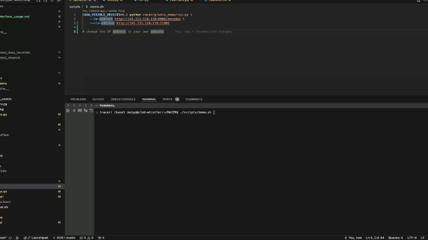

# How to use the gradio demo

### Switch from RVT to RACER during task execution
[](https://www.youtube.com/watch?v=fKy6-x9fWJE)


[Note] Since original [RACER-llava-llama3](https://huggingface.co/Yinpei/racer-llava-llama3-lora-rich) is not for model switching (RACER always requires last instruction as input, there is no last instruction input if switching model from RVT to RACER), we retrained a new RACER-llava-llama3 [checkpoint](https://huggingface.co/Yinpei/racer-llava-llama3-lora-rich-betterswitch) for better model switching particularly. This checkpoint achieves around 69.5% on 18 RLbench tasks.


### Task Goal Online Change


[](https://www.youtube.com/watch?v=RaBJL-6EOlE)

You need to:
1. Change the Task Goal, press Enter to update the goal
2. Type an immediate human instruction at current turn to tell what to do, and press Enter to send the human instruction. This may be optional, since LlaVA sometimes can generate reasonble instruction at task-goal change turn based on the new goal.


### Unseen Task Evaluation
[](https://www.youtube.com/watch?v=bAa7MTSkMjY)

First uncomment the lines of unseen tasks in `RLBENCH_TASKS` in  `racer/utils/racer_utils.py`, then run demo `python racer/gradio_demo/run.py` with `--unseen_task` argument.

### Human Language Intervention
[](https://www.youtube.com/watch?v=G7Fz2DDyjWA)

Our generated rich instructions contains specific patterns and words, it's helpful to use similar expressions. Examples are shown below:
```
move (to the) (left/right/forward/backward) (significantly/a little bit) to align with xxx
move/navigate to xxx
rotate the gripper to align (with xxx)
realign with the xxx
correct your position by moving (left/right/forward/backward) (significantly)
lift/move up the gripper
...
```


